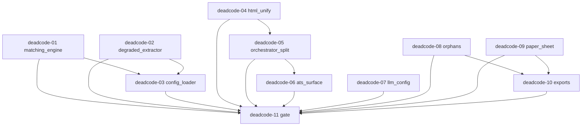

# Samuel Cleanup — Issue #1 Dead-Code Plan

## Abstract

Samuel has accumulated unused, duplicated, and contradictory code across the backend skill chain and the frontend workspace. This plan removes only proven-dead code, merges two identical Markdown-to-HTML converters into one, splits the oversized orchestrator into small helpers without changing the live progress sequence, and prunes dead exports and orphan components. Users will see no behavior change: the same four progress steps in the same order, the same rewritten resume text, and the same downloaded PDF bytes. Builders must halt and report on any contradiction instead of improvising beyond this plan.

## Source of Truth

- `docs/samuel-cleanup-context.md` (session scope, invariants, exit criteria)
- `docs/samuel-cleanup-explore-consolidated.md` (P1–P8 candidates)
- Skills consulted: `agent-orchestration-planner` (subtask schema, DAG, barriers), `linting` (import-graph safety, no out-of-scope reformat), `simplify-code` (preserve behavior, consolidate duplicates, split long functions), `coverage-strategist` (do not chase coverage; protect critical paths; delete test files only alongside their dead source), `spec-creator` (testable acceptance per subtask).

## Global Invariants (All Subtasks)

- Read-only investigation except deliverable files listed per subtask. Never touch `pt/`, never touch gitignored paths except `docs/` plans and allowed git commits by Builders later.
- No DB migrations (codeword `pear` not given). `backend/app/models/repository.py` `Vector(1536)` column stays; `backend/alembic/versions/001_initial.py` stays.
- No secrets, no raw PDF/JD/key logging, no `.env` commits.
- No Neumorphic theme changes. Frontend deletions only for zero-importer files proven by Grep.
- Preserve SSE event order exactly: `step-start/step-done` per skill, then `warning?`, `ats_evaluation`, `ats_loop`, `ats_stagnation`, `output`, `done`. Cached-replay guard in `routers/generate.py` lines 118–151 stays byte-equivalent in behavior.
- Preserve PDF byte-identity: primary path is `services/pdf_extractor.py::rewrite_pdf_layout`; fallback `services/pdf_renderer.py::render_resume_to_pdf` only when `original_pdf` is None.
- Semi-minimum: large deletions only with zero prod importers proven by Grep output recorded in the subtask summary.
- Contradiction policy: on any HALT condition below, stop, report file, line, and cause, propose fix, request approval. Do not auto-fix beyond plan.
- Verify per subtask: `uv run pytest -q` (backend) and `tsc --noEmit` via pnpm (frontend) where files of that stack were touched. Record Grep evidence for zero-importer claims.

## Canonical Decisions (Contradictions Resolved, No Code Change Beyond Subtasks)

- `ats_max_iterations`: `schemas/__init__.py::GenerateRequest._clamp_max_iter` raises on out-of-range API input (5–7); `config.py::Settings._clamp_iter` clamps env-var input to 5–7. Both stay. Not contradictory; different layers.
- `ats_threshold` None/0: canonical single-pass signal. `routers/generate.py:184` (`not in (None, 0)`) and `orchestrator.py:191` (`is None or == 0`) both stay; subtask deadcode-06 extracts shared predicate without changing semantics.
- ATS score: `orchestrator.py::run` uses deterministic `ATS().evaluate`; `run_with_ats_loop` uses `self._evaluate_ats` via `ats_registry`. Both stay; subtask deadcode-07 only removes the never-registered criterion and the deprecated wrapper.
- `_text_to_html`: `routers/generate.py:513-587` and `services/pdf_renderer.py:18-90` are ~90% identical. Canonical owner is `services/pdf_renderer.py::_text_to_html`. Router imports it (subtask deadcode-04).

## Atomic Subtasks

### deadcode-01 — Delete test-only matching engine

```json
{
  "id": "deadcode-01",
  "seq": "01",
  "title": "Delete test-only matching engine",
  "status": "pending",
  "depends_on": [],
  "parallel": true,
  "suggested_role": "Implementer",
  "deliverables": [
    "backend/app/services/matching_engine.py",
    "backend/tests/test_matching_engine.py"
  ],
  "context_files": [
    "docs/samuel-cleanup-context.md",
    "docs/samuel-cleanup-explore-consolidated.md"
  ],
  "reference_files": [
    "backend/app/orchestrator.py",
    "backend/app/services/ats.py"
  ],
  "acceptance_criteria": [
    "Grep `from app.services.matching_engine import|from app.services import matching_engine` returns hits only inside the two deliverables before deletion and zero hits after",
    "`uv run pytest -q` passes with test_matching_engine.py removed (no collection error)",
    "No edit to orchestrator.py, routers, or models in this subtask"
  ],
  "started_at": null,
  "completed_at": null,
  "completion_summary": null
}
```

Detail: `evaluate_match` (`matching_engine.py:312`, 386 lines) has zero prod importers; only `backend/tests/test_matching_engine.py` and `test_degraded_extractor.py:103` (guarded import with skip) reference it. Delete source file plus its dedicated test file. Do not touch `test_degraded_extractor.py` here (owned by deadcode-02). HALT if Grep finds any prod importer outside `backend/tests/`.

### deadcode-02 — Delete degraded extractor and profile

```json
{
  "id": "deadcode-02",
  "seq": "02",
  "title": "Delete degraded extractor and profile",
  "status": "pending",
  "depends_on": [],
  "parallel": true,
  "suggested_role": "Implementer",
  "deliverables": [
    "backend/app/services/degraded_extractor.py",
    "backend/tests/test_degraded_extractor.py",
    "backend/app/config/degraded_profiles.json"
  ],
  "context_files": [
    "docs/samuel-cleanup-context.md",
    "docs/samuel-cleanup-explore-consolidated.md"
  ],
  "reference_files": [
    "backend/app/main.py",
    "backend/app/services/ats_config_loader.py"
  ],
  "acceptance_criteria": [
    "Grep `degraded_extractor|degrade_resume|degraded_profiles` returns zero hits outside docs after deletion",
    "`uv run pytest -q` passes with no collection error",
    "`backend/app/main.py` content unchanged (asserted by the deleted test's own guard: no prod import of degraded_extractor)"
  ],
  "started_at": null,
  "completed_at": null,
  "completion_summary": null
}
```

Detail: `degrade_resume` (`:317`), `degrade_resume_json` (`:374`), 380 lines, test-only. Its private `_load_header_keywords`/`_load_synonyms` read `degraded_profiles.json`; no prod reader exists. HALT if any non-test importer appears.

### deadcode-03 — Delete orphaned ATS config loader

```json
{
  "id": "deadcode-03",
  "seq": "03",
  "title": "Delete orphaned ATS config loader",
  "status": "pending",
  "depends_on": ["deadcode-01", "deadcode-02"],
  "parallel": false,
  "suggested_role": "Implementer",
  "deliverables": [
    "backend/app/services/ats_config_loader.py"
  ],
  "context_files": [
    "docs/samuel-cleanup-context.md",
    "docs/samuel-cleanup-explore-consolidated.md"
  ],
  "reference_files": [
    "backend/app/services/matching_engine.py",
    "backend/app/services/degraded_extractor.py"
  ],
  "acceptance_criteria": [
    "After deadcode-01/02, Grep `ats_config_loader|load_ats_weights|load_degree_map|load_seniority_map|load_skills_taxonomy|load_synonyms|load_header_keywords` returns zero hits in backend/app outside the loader file itself",
    "Loader file deleted; all six JSONs under backend/app/config/ kept untouched (minimal diff)",
    "`uv run pytest -q` passes"
  ],
  "started_at": null,
  "completed_at": null,
  "completion_summary": null
}
```

Detail: `load_ats_weights`, `load_degree_map`, `load_seniority_map`, `load_skills_taxonomy`, `load_synonyms`, `load_header_keywords` are consumed only by the deleted P1 files. Keep JSON data files to stay minimal; document retention in summary. HALT if any surviving importer exists (means deadcode-01/02 incomplete).

### deadcode-04 — Unify Markdown-to-HTML and kill WeasyPrint backup

```json
{
  "id": "deadcode-04",
  "seq": "04",
  "title": "Unify Markdown-to-HTML and kill WeasyPrint backup",
  "status": "pending",
  "depends_on": [],
  "parallel": true,
  "suggested_role": "Implementer",
  "deliverables": [
    "backend/app/services/pdf_renderer.py",
    "backend/app/routers/generate.py"
  ],
  "context_files": [
    "docs/samuel-cleanup-context.md",
    "docs/samuel-cleanup-explore-consolidated.md"
  ],
  "reference_files": [
    "backend/app/services/pdf_extractor.py",
    "backend/tests/test_pdf_regen_loop.py"
  ],
  "acceptance_criteria": [
    "Single `_text_to_html` definition remains in services/pdf_renderer.py; routers/generate.py imports it instead of defining its own (no local def _text_to_html)",
    "`_weasyprint_backup` (generate.py:381) and `render_resume_to_pdf_with_css` + `_build_html(css)` param deleted; `render_resume_to_pdf` and `_build_html(resume_html)` default path unchanged",
    "Byte-identity check: `_text_to_html` output for a fixture with Skills/Projects JSON fence, trailing ## Projects, and ### entries is identical before/after (record fixture hash in summary)",
    "`uv run pytest -q` passes including test_pdf_regen_loop.py"
  ],
  "started_at": null,
  "completed_at": null,
  "completion_summary": null
}
```

Detail per simplify-code/linting: canonicalize on `pdf_renderer._text_to_html` (typed `parts: list[str]` variant). Router keeps `preview_html` and `download_pdf` behavior; only the helper origin changes. `_weasyprint_backup` has zero callers (Grep proves). `render_resume_to_pdf_with_css` has zero callers. HALT if any caller of either is found or if fixture HTML diverges.

### deadcode-05 — Split orchestrator preamble and PDF fallback

```json
{
  "id": "deadcode-05",
  "seq": "05",
  "title": "Split orchestrator preamble and PDF fallback",
  "status": "pending",
  "depends_on": ["deadcode-04"],
  "parallel": false,
  "suggested_role": "Implementer",
  "deliverables": [
    "backend/app/orchestrator.py"
  ],
  "context_files": [
    "docs/samuel-cleanup-context.md",
    "docs/samuel-cleanup-explore-consolidated.md"
  ],
  "reference_files": [
    "backend/app/services/pdf_renderer.py",
    "backend/app/services/pdf_extractor.py",
    "backend/app/routers/generate.py"
  ],
  "acceptance_criteria": [
    "orchestrator.py exposes helpers `_load_context()`, `_run_skill_chain()`, `_render_pdf_bytes()` and all three call sites (run, run_with_ats_loop single-pass branch, loop branch) use them with zero duplicated preamble/fallback blocks",
    "SSE event order unchanged: warning, jd_parser, project_matcher, resume_writer, ats_checker, ats_evaluation, ats_loop, ats_stagnation, output, done verified by test_threshold_trigger, test_max_iterations, test_pdf_regen_loop passing",
    "`uv run pytest -q` passes; file stays under same public API (run, run_with_ats_loop, _get_user, _get_generation, _get_repos signatures unchanged)"
  ],
  "started_at": null,
  "completed_at": null,
  "completion_summary": null
}
```

Detail: extract don't rewrite. `_load_context` = `_get_generation` + user fetch + `extract_sections` + `_get_repos` + fallback `warning` payload. `_render_pdf_bytes(original_pdf, new_skills, new_projects, full_text)` = in-place `rewrite_pdf_layout` try/except + `render_resume_to_pdf` only when `original_pdf is None`. Threshold None/0 and clamp logic move verbatim into helpers. HALT if event-order test fails or PDF bytes path changes.

### deadcode-06 — Remove dead ATS surface

```json
{
  "id": "deadcode-06",
  "seq": "06",
  "title": "Remove dead ATS surface",
  "status": "pending",
  "depends_on": ["deadcode-05"],
  "parallel": false,
  "suggested_role": "Implementer",
  "deliverables": [
    "backend/app/services/ats.py",
    "backend/app/ats.py",
    "backend/app/skills/ats_checker.py"
  ],
  "context_files": [
    "docs/samuel-cleanup-context.md",
    "docs/samuel-cleanup-explore-consolidated.md"
  ],
  "reference_files": [
    "backend/app/orchestrator.py",
    "backend/tests/test_ats.py"
  ],
  "acceptance_criteria": [
    "`SectionHeaderCriterion` class deleted from services/ats.py; `ATS()` default criteria remains `[KeywordMatchCriterion()]`; `add_criterion` method kept",
    "`app/ats.py` re-exports only ATS, ATSContext, ATSCriterion, CriterionResult, KeywordMatchCriterion (no SectionHeaderCriterion)",
    "`skills/ats_checker.py` (ATSCheckerSkill, 19 lines, zero prod importers) deleted; Grep `SectionHeaderCriterion|ATSCheckerSkill` returns hits only in backend/tests after change",
    "`uv run pytest -q` passes; test_ats.py updated only to drop the SectionHeaderCriterion import if it fails collection"
  ],
  "started_at": null,
  "completed_at": null,
  "completion_summary": null
}
```

Detail: `SectionHeaderCriterion` (`ats.py:127`) never registered in prod (only `test_ats.py` constructs custom criteria via `add_criterion`, which stays). Sequential after deadcode-05 because both touch the ATS import graph via orchestrator. HALT if any prod `add_criterion(SectionHeaderCriterion` or `ATSCheckerSkill(` caller exists.

### deadcode-07 — Prune dead LLM embed and config fields

```json
{
  "id": "deadcode-07",
  "seq": "07",
  "title": "Prune dead LLM embed and config fields",
  "status": "pending",
  "depends_on": [],
  "parallel": true,
  "suggested_role": "Implementer",
  "deliverables": [
    "backend/app/utils/llm.py",
    "backend/app/config.py"
  ],
  "context_files": [
    "docs/samuel-cleanup-context.md",
    "docs/samuel-cleanup-explore-consolidated.md"
  ],
  "reference_files": [
    "backend/app/models/repository.py",
    "backend/app/routers/generate.py",
    "backend/app/routers/resume.py"
  ],
  "acceptance_criteria": [
    "`LLMClient.embed` (llm.py:197) deleted; Grep `\\.embed\\(` returns zero hits in backend/app and backend/tests",
    "`log_level` and `debug_retention_hours` removed from config.py; Grep proves zero readers (only debug_dir is read in main.py/orchestrator/history)",
    "`openrouter_key` alias property kept untouched (still read by routers/generate.py:159 and resume.py:99); `repository.py Vector(1536)` column and migration kept untouched (no DB change)",
    "`uv run pytest -q` passes including test_threshold_config.py"
  ],
  "started_at": null,
  "completed_at": null,
  "completion_summary": null
}
```

Detail per coverage-strategist: no new tests for deleted code; protect `complete`/`_chat`/`extract_json` paths. HALT if any `.embed(` caller or `settings.log_level`/`settings.debug_retention_hours` reader is found.

### deadcode-08 — Delete orphan frontend components

```json
{
  "id": "deadcode-08",
  "seq": "08",
  "title": "Delete orphan frontend components",
  "status": "pending",
  "depends_on": [],
  "parallel": true,
  "suggested_role": "Implementer",
  "deliverables": [
    "frontend/src/components/BorromeanBanner.tsx",
    "frontend/src/components/BorromeanLogo.tsx",
    "frontend/src/components/DashboardGrid/"
  ],
  "context_files": [
    "docs/samuel-cleanup-context.md",
    "docs/samuel-cleanup-explore-consolidated.md"
  ],
  "reference_files": [
    "frontend/src/components/Borromean3DViewer.tsx",
    "frontend/src/components/BorromeanLoader.tsx"
  ],
  "acceptance_criteria": [
    "Grep `BorromeanBanner|BorromeanLogo|DashboardGrid` returns zero hits in frontend/src outside docs after deletion (Borromean3DViewer and BorromeanLoader stay, still imported by page/dashboard/progress components)",
    "Three paths deleted: BorromeanBanner.tsx (292 lines), BorromeanLogo.tsx (46 lines), DashboardGrid/DashboardGrid.tsx + index.ts barrel",
    "`pnpm tsc --noEmit` passes from frontend/"
  ],
  "started_at": null,
  "completed_at": null,
  "completion_summary": null
}
```

Detail: all zero importers proven. Do not touch live `Borromean3DViewer`, `BorromeanLoader`, or any Neumorphic styles. HALT if any importer is found.

### deadcode-09 — Delete PDF-fork paper sheet path

```json
{
  "id": "deadcode-09",
  "seq": "09",
  "title": "Delete PDF-fork paper sheet path",
  "status": "pending",
  "depends_on": [],
  "parallel": true,
  "suggested_role": "Implementer",
  "deliverables": [
    "frontend/src/components/ResumePaperSheet.tsx",
    "frontend/src/lib/resume-parser.ts",
    "frontend/src/components/ResumeIcons.tsx"
  ],
  "context_files": [
    "docs/samuel-cleanup-context.md",
    "docs/samuel-cleanup-explore-consolidated.md"
  ],
  "reference_files": [
    "frontend/src/components/ResumePreviewer.tsx",
    "frontend/src/hooks/useGenerationStream.ts"
  ],
  "acceptance_criteria": [
    "Grep `ResumePaperSheet|parseResumeText|resume-parser` returns zero hits in frontend/src after deletion; previewer stays PDF-only via getDownloadUrl blob in ResumePreviewer.tsx and useGenerationStream.ts",
    "ResumePaperSheet.tsx (241 lines) and resume-parser.ts (132 lines) deleted; ResumeIcons.tsx edited only to remove PinIcon (other icons kept)",
    "`pnpm tsc --noEmit` passes"
  ],
  "started_at": null,
  "completed_at": null,
  "completion_summary": null
}
```

Detail: conditional on PDF-only invariant holding (ResumePreviewer uses `getDownloadUrl`, never PaperSheet). `PinIcon` (`ResumeIcons.tsx:48`) has zero importers; other icons stay. HALT if any `ResumePaperSheet` or `parseResumeText` importer outside the two deleted files appears.

### deadcode-10 — Prune dead frontend exports, keep routes

```json
{
  "id": "deadcode-10",
  "seq": "10",
  "title": "Prune dead frontend exports, keep routes",
  "status": "pending",
  "depends_on": ["deadcode-08", "deadcode-09"],
  "parallel": false,
  "suggested_role": "Implementer",
  "deliverables": [
    "frontend/src/lib/api.ts",
    "frontend/src/lib/types.ts"
  ],
  "context_files": [
    "docs/samuel-cleanup-context.md",
    "docs/samuel-cleanup-explore-consolidated.md"
  ],
  "reference_files": [
    "frontend/src/hooks/useGenerationStream.ts",
    "frontend/src/components/ResultsActionBar.tsx"
  ],
  "acceptance_criteria": [
    "`createGenerationStream` and `getPreviewHtmlUrl` removed from lib/api.ts (hook uses inline EventSource, previewer uses getDownloadUrl); backend GET preview-html endpoint kept",
    "`target_jd`, `StepEvent`, `DoneEvent` removed from lib/types.ts; `has_openrouter_key` removed (frontend uses has_key via getKeyStatus; backend never returns has_openrouter_key); five live barrel index.ts files untouched",
    "Five redirect stubs (app/results, result, dashboard/history, dashboard/results, dashboard/result) kept as-is (routes, not dead code); no route file deleted",
    "`pnpm tsc --noEmit` passes"
  ],
  "started_at": null,
  "completed_at": null,
  "completion_summary": null
}
```

Detail: sequential after 08/09 so barrel ownership is unambiguous (DashboardGrid barrel already gone). HALT if any importer of the pruned exports exists or if tsc fails.

### deadcode-11 — Dead-code verification gate

```json
{
  "id": "deadcode-11",
  "seq": "11",
  "title": "Dead-code verification gate",
  "status": "pending",
  "depends_on": ["deadcode-01", "deadcode-02", "deadcode-03", "deadcode-04", "deadcode-05", "deadcode-06", "deadcode-07", "deadcode-08", "deadcode-09", "deadcode-10"],
  "parallel": false,
  "suggested_role": "Implementer",
  "deliverables": [
    "docs/samuel-cleanup-plan-deadcode.md"
  ],
  "context_files": [
    "docs/samuel-cleanup-context.md",
    "docs/samuel-cleanup-explore-consolidated.md"
  ],
  "reference_files": [
    "backend/app/routers/generate.py",
    "backend/app/orchestrator.py",
    "frontend/src/hooks/useGenerationStream.ts"
  ],
  "acceptance_criteria": [
    "`uv run pytest -q` green and `pnpm tsc --noEmit` green recorded with commit hashes in the completion summary",
    "Grep sweep recorded: matching_engine, degraded_extractor, ats_config_loader, _weasyprint_backup, SectionHeaderCriterion, ATSCheckerSkill, .embed(, BorromeanBanner, BorromeanLogo, DashboardGrid, ResumePaperSheet, parseResumeText, PinIcon, createGenerationStream, StepEvent, DoneEvent, target_jd, has_openrouter_key all zero in prod source",
    "SSE order and PDF invariant attested: step-start/done sequence unchanged, rewrite_pdf_layout primary path unchanged, no DB migration, no pt/ or gitignored touch, no theme change"
  ],
  "started_at": null,
  "completed_at": null,
  "completion_summary": null
}
```

Detail: update only this plan file with evidence table and per-subtask completion summaries. No source edits. HALT and report on any red test or resurrected importer.

## Validation (Pre-Dispatch)

- Seq unique: 01–11, each id `deadcode-NN` unique.
- Every `depends_on` references an existing id; no self-dependency.
- No cycles: 01,02,04,07,08,09 root; 03 after 01,02; 05 after 04; 06 after 05; 10 after 08,09; 11 after all.
- Every subtask has 1–3 deliverables and ≥1 testable acceptance criterion; every `completion_summary` present as null placeholder.
- Parallel flags respect shared files: generate.py touched only by 04; orchestrator.py only by 05; ats surface only by 06; frontend lib only by 10.

## DAG



Batches: Batch A parallel (01, 02, 04, 07, 08, 09). Barrier. Batch B (03 after 01+02; 05 after 04). Barrier. Batch C (06 after 05; 10 after 08+09). Barrier. Batch D gate (11).

## To-Do

- [ ] Execute `deadcode-01` per §Atomic Subtasks (see detail up-plan), then report `completion_summary`
- [ ] Execute `deadcode-02` per §Atomic Subtasks (see detail up-plan), then report `completion_summary`
- [ ] Execute `deadcode-04` per §Atomic Subtasks (see detail up-plan), then report `completion_summary`
- [ ] Execute `deadcode-07` per §Atomic Subtasks (see detail up-plan), then report `completion_summary`
- [ ] Execute `deadcode-08` per §Atomic Subtasks (see detail up-plan), then report `completion_summary`
- [ ] Execute `deadcode-09` per §Atomic Subtasks (see detail up-plan), then report `completion_summary`
- [ ] Execute `deadcode-03` per §Atomic Subtasks after 01+02 (see detail up-plan), then report `completion_summary`
- [ ] Execute `deadcode-05` per §Atomic Subtasks after 04 (see detail up-plan), then report `completion_summary`
- [ ] Execute `deadcode-06` per §Atomic Subtasks after 05 (see detail up-plan), then report `completion_summary`
- [ ] Execute `deadcode-10` per §Atomic Subtasks after 08+09 (see detail up-plan), then report `completion_summary`
- [ ] Execute `deadcode-11` verification gate after all (see detail up-plan), then report `completion_summary`
